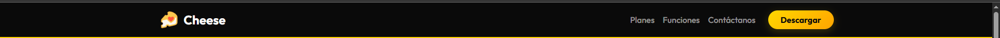
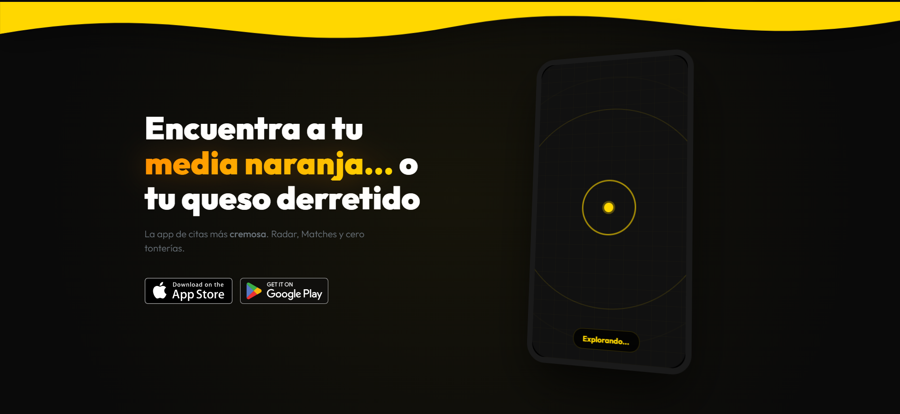
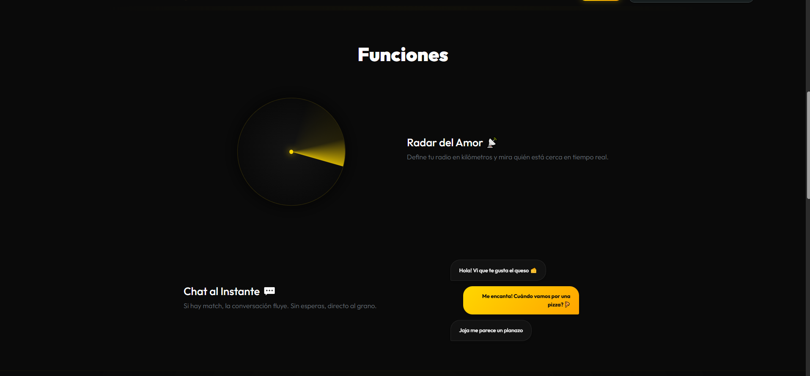
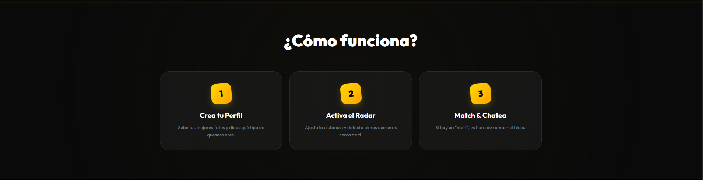
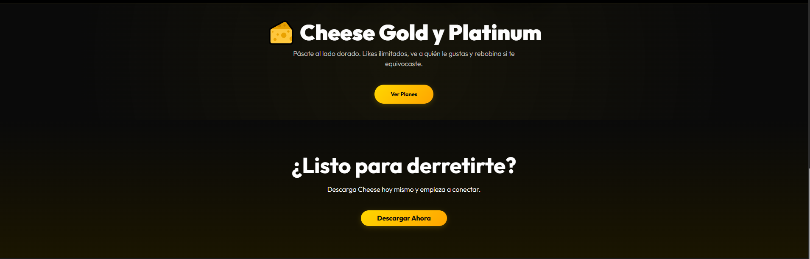
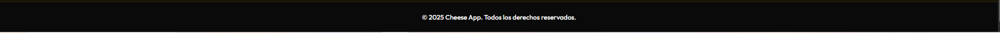
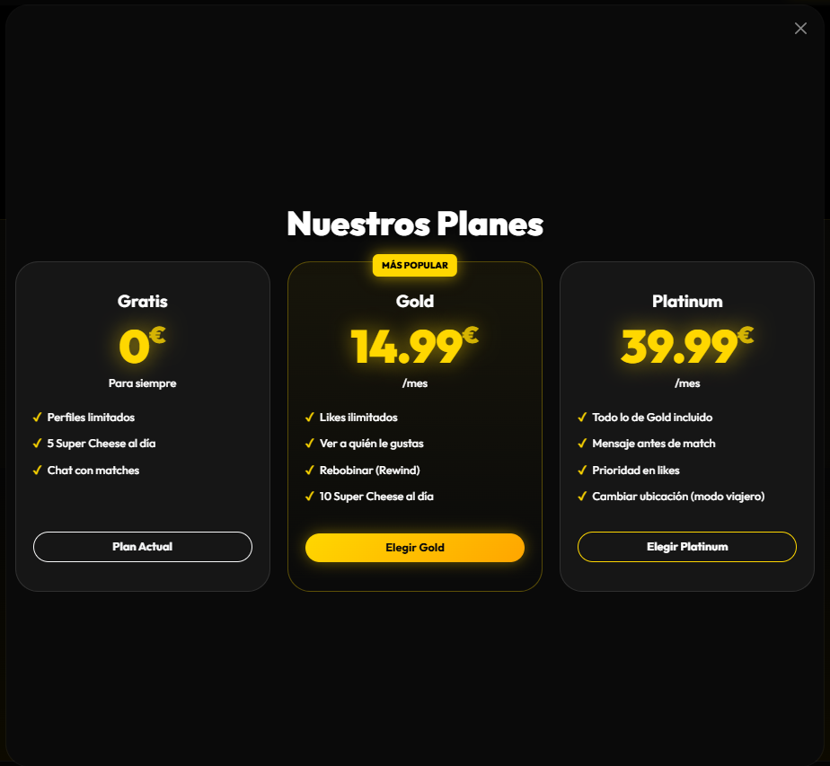

📋 Plan de Trabajo: Migración a Angular (CheeseEnAngular)

    [1] Quiero que hagas el componente llamado navbar como esta imagen: 
    [2] Quiero que hagas el componente llamado hero como esta imagen: , el movil tiene que tener una animacion de ondas de dentro hacia afuera.
    [3] Quiero que hagas un componente llamado funciones como esta imagen: , quiero que el radar tenga una animacion de rotacion en bucle.
    [4] Quiero que hagas un componente llamado funcionamiento como esta imagen: , quiero que al pasar el cursor sobre una caja haga un efecto de zoom suave y borde de la caja amarillo. 
    [5] Quiero que hagas un componente llamado vistazo como esta imagen: , quiero que al pasar el cursor por un movil se haga un pequeño zoom, las fotos las pondré manualmente.
    [6] Quiero que hagas dos componentes, el primero llamado etiqueta-planes y el segundo llamado etiqueta-descarga , etiqueta-planes será la caja donde esta ubicada el boton de "Ver Planes" y etiqueta-descarga será la caja donde esta ubicada el boton de "Descargar Ahora".
    [7] Quiero que hagas un componente llamado footer como esta imagen: , el footer solo tiene que aparecer cuando la persona llegue al final de la web.
    [8] Quiero que me hagas un componente llamado planes como esta imagen: , es una ventana flotante que aparecerá al darle al boton de "Ver Planes" del componente etiqueta-planes y tambien se abrirá al darle al boton de "Planes" del navbar. Cuando se le de a la X se cerrará. Al pasar por el cursor de algún plan se hará un zoom suave y el borde amarillo.
    [9] Quiero que en el navbar me agregues un boton de "Iniciar Sesion" y "Registrarse".
    [10] Quiero que el boton iniciar sesion y registrarse tengan un color de fondo amarillo y un color de texto negro, cuando se les pase el cursor se haran mas grandes. Al darle al boton de registrarse se mostrará una ventana flotante con un formulario de registro, los campos seran nombre, email y contraseña. El formulario tendrá un boton de registrarse que al darle se cerrará la ventana y se mostrará un mensaje de "Usuario registrado correctamente". Los datos que el usuario pondrá en la ventana de registrarse o de iniciar sesion no se harán anda con ellos, los puedes olvidar.
    [11] Quiero que me crees una ventana flotante para iniciar sesion, se abrirá al darle al boton de iniciar sesion del navbar. Cuando se le de a la X se cerrará. Tiene un campo de email, un campo de contraseña y un boton de iniciar sesion que al darle se cerrará la ventana y se mostrará un mensaje de "Usuario registrado correctamente". Los datos que el usuario pondrá en la ventana de iniciar sesion no se harán anda con ellos, los puedes olvidar. 
    

Cada vez que hayas modificado algo quiero que me modifiques el archivo .usoDeIA/logs.md y me pongas en un parrafo de maximo 4 lineas resumidamente que es lo que has modificado, también quiero que me pongas la fecha y la hora de la modificación. 
El log seguirá el siguiente formato:

## [Fecha y hora]

[Descripción de la modificación]

## ✅ Tareas Completadas

Fase 1: Configuración del Entorno y EstructuraEsta fase es el "esqueleto" del proyecto. Sin esto, no podemos empezar a programar de forma organizada.

    [1] Inicialización del Proyecto: Crear el proyecto Angular y limpiar el contenido por defecto del app.component.html.
    [2] Instalación de Dependencias: Instalar Bootstrap mediante npm y configurar los scripts/styles en el archivo angular.json.
    [3] Organización de Directorios: Crear la estructura de carpetas en src/app/: /components, /models y /services.
    [4] Gestión de Activos (Public): Trasladar todas las imágenes, iconos y recursos multimedia de la web antigua a la nueva carpeta public/si no hay,creala.

Fase 2: Definición de Modelos y ArquitecturaAquí preparamos la lógica MVC (Modelo-Vista-Controlador).

    [5] Creación de Modelos: Definir las interfaces de TypeScript (ej. Seccion.model.ts) para tipar los textos y datos de la web.
    [6] Generación de Componentes Base: Utilizar el CLI de Angular (ng g c) para crear los 4 pilares:
    HeaderComponent HeroComponent ContentSectionComponent (Componente reutilizable) y FooterComponent.

Fase 3: Implementación del Diseño y UI-UXEn este punto volcamos el diseño visual y los estilos que mencionas (Negro y Amarillo).

    [7] Configuración de Estilos Globales: Definir la tipografía Sans-Serif y los colores base (fondos negros, acentos amarillos) en el archivo styles.css.
    [8] Maquetación con Bootstrap: Implementar el sistema de rejillas para que las secciones sean responsive.Desarrollo del Scroll-Snap: Aplicar las propiedades CSS para que cada sección ocupe el $100vh$ y el scroll sea magnético y fluido.

    Fase 4: Refactorización y ContenidoPasamos el contenido real de la web antigua al nuevo sistema de componentes.

    Migración de Contenido:
    [9] Repartir los textos e imágenes del proyecto original dentro de los nuevos componentes de Angular.
    [10] Encapsulamiento de Estilos: Mover el CSS específico de cada sección a su propio archivo .css de componente para evitar conflictos.